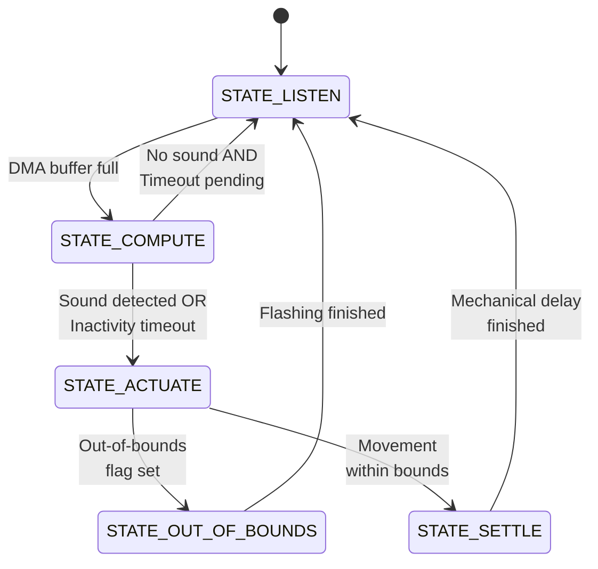

# Real-Time Sound Source Localization and Tracking System

| Name | Matr. | Email |
|------|---------|-------|
| Samuele Ribaudo | 03821248 | samuele.ribaudo@tum.de |
| Hong Yan Jun  | 03813507 | go75kes@mytum.de |

> To see the engineering challenges we encountered and our solutions to overcome them, check out the [technical report ↗](documentation/techincal_report.md)

## 1. Project overview

This project is a robotic "hearing" system that can detect where a sound is coming from and automatically turn to face it.

Using an STM32 microcontroller and two standard microphones, the system acts like a pair of human ears. When a person speaks, the system calculates the sound's origin and uses a servo motor to physically rotate the sensor array toward the speaker. It is designed to mimic a human neck's 180° range of motion. If a sound moves beyond what the system can physically reach, an onboard RGB LED signals a visual warning, acting as a modular trigger that would theoretically tell a larger humanoid robot to rotate its entire body.

---

## 2. Project structure

```text
.
├── README.md                 # Main project overview
├── code/                     # Project's firmware and STM32 build configuration
├── documentation/            # Academic documentation and project presentations
├── hardware/                 # Schematic files and custom structural designs
├── resources/                # Media assets and external reference documentation
└── testing/                  # Standalone testing frameworks
```

> NOTE: every main directory in this repository contains a dedicated `README.md`. Please refer to those local files for thorough setup steps, configuration details, and specialized technical overviews relevant to each module.


---

## 3. Detailed system description

At a technical level, this project implements an embedded Sound Source Localization (SSL) and tracking system utilizing a NUCLEO-U083RC microcontroller developed within the STM32CubeIDE environment. The system continuously records environmental audio via two analog microphones spaced at a fixed distance. Using cross-correlation algorithms and digital filters, the system calculates the Time Delay of Arrival (TDOA) between the microphones to determine the precise azimuth angle of a human speaker.

To overcome the processing limitations of the micro controller and the physical realities of robotics, the system employs clever hardware-software design. It uses an acoustic foam baffle to eliminate the front-back "cone of confusion", calculates all math algorithms from scratch without relying on pre-built DSP libraries, and utilizes a strict "Listen-Compute-Move" state machine to prevent mechanical servo noise from corrupting the audio buffers. A 180° servo motor dynamically actuates the sensor array using a "relative-to-absolute" coordinate mapping to track the sound source.

---
## 4. Required materials

| **Component** | **Qty** | **Description** |
| --- | --- | --- |
| NUCLEO-U083RC Development Board | 1 | The central processing unit of the system. It handles the high-speed ADC sampling via DMA, executes the mathematical cross-correlation algorithms, maintains the global coordinate tracking variables, and outputs the PWM control signals. | 
| MAX4466 analog microphones | 2 | Two independent analog microphones capture the environmental audio.|
| 180° servo motor | 1 | The mechanical actuator that rotates the sensor frame. |
| Acoustic foam block | 1 | High-density foam sponge to block rear audio signals. |
| RGB LED | 1 | A 4 pin RGB LED that provides real-time visual feedback of the state machine. It acts as a crucial flag for modular robotic design, flashing red when the target escapes the 180° physical field of hearing to trigger a "handoff" to a theoretical humanoid torso. |
| 330 Ohm resistor | 3 | Resistors placed in series with the RGB LED channels to prevent overcurrent damage. |
| PLA and TPU filament (3D Printing) | 1 | Material for printing the frame, board, servo mounts and ears (TPU). |
| Assorted wires | 1 | General circuit routing and power distribution. |

---
## 5. Physical connections & pin mapping

The system architecture utilizes dedicated hardware peripherals on the NUCLEO-U083RC board to handle high-speed data acquisition and actuation without blocking core application logic. The diagram below details the exact physical signal and power routing for each system component.

```text
                                ┌───────────────────────────────┐
                                │     STM32U083RC (Nucleo)      │                               5V power supply
                                │                               │                             ┌────────────────┐
                                │                          [GND]│─────────────────────────────│o  GND          │
                                │                          [VDD]│───┬─────────────────────────│o  5V           │
        Analog Left Mic         │                               │   │   180° Servo Morot      └────────────────┘
    ┌────────────────────┐      │                               │   │  ┌──────────────────┐
    │     OUT / Signal  o│─────>│[PC0]                          │   └──│o  VCC            │
    │              VCC  o│──────│[5V]                     [PA15]│─────>│o  PWM signal     │
    │              GND  o│──────│[GND]                     [GND]│──────│o  GND            │
    └────────────────────┘      │         ┌───────────┐         │      └──────────────────┘
                                │         │           │         │
        Analog Right Mic        │         │   STM32   │         │           RGB LED
    ┌────────────────────┐      │         │           │         │      ┌──────────────────┐
    │     OUT / Signal  o│─────>│[PC1]    └───────────┘   [PB13]│─────>│o  Red channel    │
    │              VCC  o│──────│[5V]                     [PB14]│─────>│o  Green channel  │
    │              GND  o│──────│[GND]                    [PB15]│─────>│o  Blue channel   │
    └────────────────────┘      │                          [GND]│──────│o  GND            │
                                │                               │      └──────────────────┘
                                └───────────────────────────────┘
```

To improve system readability and simplify debugging, we adopted a standardized, purpose-driven wire coloring scheme:

| Wire color | Purpose / Connection |
| --- | --- |
| White | Main 5V power supply line routed to the components. |
| Black | Common Ground (GND) connection to establish a shared reference plane. |
| Red | Digital control for the RGB LED Red channel. |
| Green | Digital control for the RGB LED Green channel. |
| Blue | Digital control for the RGB LED Blue channel. |
| Orange | Dedicated PWM signal line to control the 180° servo motor actuation. |
| Purple | Analog output signal transmission from the left microphone. |
| Yellow | Analog output signal transmission from the right microphone. |


---
## 6. MCU peripherals configuration

#### Timer 2 (PWM)

* **Clock Source**: Internal clock (16 MHz).
* **Channel 1**: PWM Generation CH1 (pin PA15).
* **Counter Settings**:
    * Prescaler (PSC): 15
    * Counter Mode: Up
    * Counter Period (ARR): 19999
    * Auto-reload preload: Enable

* **PWM Generation Channel 1**:
    * Mode: PWM mode 1
    * Pulse: 1500
    * CH Polarity: High

* **Configuration Logic**: Dividing the 16 MHz clock by 15 + 1 configures the timer to run at exactly 1 MHz, meaning 1 timer tick equals 1 microsecond. Counting to 19999 + 1 ticks creates a 20 ms period (50 Hz). Setting the initial Pulse to 1500 (1.5 ms) guarantees that the motor centers immediately upon power-up.

#### Timer 3 (ADC)

* **Clock Source**: Internal clock (16 MHz).
* **Counter Settings**:
    * Prescaler (PSC): 0
    * Counter Mode: Up
    * Counter Period (ARR): 319
    * Trigger Event Selection (TRGO): Update Event


#### ADC

* **Channels Enabled**: CH0 (PC0) and CH1 (PC1)
* **Resolution**: 12-bit resolution
* **External Trigger Conversion Source**: Timer 3 Trigger Out event (TRGO)
* **External Trigger Conversion Edge**: Rising Edge
* **Scan Conversion Mode**: Enabled
* **Number of Conversions**: 2

#### DMA

* **Direction**: Peripheral to memory
* **Mode**: Normal mode
* **Data Width**: 16-bit (half word)

#### GPIO LED

* **Pins**: PB13, PB14, and PB15 configured as GPIO Output.
* **Hardware Labels**: PB13 → LED_R, PB14 → LED_G, PB15 → LED_B.

---

## 7. The FSM & tracking logic breakdown

Because servo gears create acoustic noise, the system cannot listen and move at the same time. To address this limitation, the system relies on a strict, sequential FSM:


> Figure: State transition diagram for the acoustic localization and tracking pipeline.

* `STATE_LISTEN` (Blue): The servo is locked while the ADC+DMA pipeline records 1024 audio samples. Once the buffer is full, the DMA interrupt wakes the CPU and transitions the system to the compute phase.

* `STATE_COMPUTE` (Blue): Recording halts and the raw data is split and passed through the DSP pipeline.
    * If a sound is detected, the system calculates the angle offset, applies it to the current angle (flagging if it exceeds physical limits), and moves to `STATE_ACTUATE`.
    * If no sound is detected, the system checks an inactivity timeout. If the silence exceeds the maximum allowed time and the servo is not already centered, it targets the center position and moves to `STATE_ACTUATE`. Otherwise, it simply rolls back to `STATE_LISTEN`.


* `STATE_ACTUATE` (Green): The MCU updates the servo's position. If an out-of-bounds value was flagged during computation, the FSM transitions directly to `STATE_OUT_OF_BOUNDS`. If the movement is within normal limits, it proceeds to `STATE_SETTLE`.

* `STATE_SETTLE` (Green): A brief, blocking delay allows all mechanical servo vibrations to dissipate before the system safely loops back to `STATE_LISTEN`.

* `STATE_OUT_OF_BOUNDS` (Red Flash): The out-of-bounds flag is cleared, and the system flashes the red LED to provide a visual warning that the target exceeded the 180° physical limit. Once the flashing sequence finishes, it returns to `STATE_LISTEN`.

---

## 8. System validation and results

The digital signal processing (DSP) pipeline was fully validated on the NUCLEO-U083RC microcontroller, proving that the real-time cross-correlation and Time Delay of Arrival (TDOA) algorithms accurately track acoustic sources.

### 8.1 Signal filtering performance
To isolate human speech from environmental noise, the incoming audio passes through a custom 6th-order Butterworth bandpass filter (300 Hz to 3000 Hz). As shown below, the filter successfully suppresses low-frequency hums (100 Hz) and high-frequency noise (6 kHz), completely flattening the noise floor to provide clean signals for cross-correlation:


> *Figure: Raw recording with environmental noise disturbances (top) and the resulting clean, flattened noise floor after 6th-order filtering (bottom).*

### 8.2 Pipeline execution and sound tracking
When a sound is detected, the conditioned signals undergo a boundary-optimized cross-correlation to pinpoint the exact time delay. 

The system validation capture below highlights a successful test with a sound source on the right side. The pipeline filters out heavy background noise and produces a sharp, singular cross-correlation peak at a 22-sample lag. This precise shift allows the geometric logic to accurately calculate the angle and smoothly actuate the servo motor toward the target.


> *Figure: Complete validation of a right-side tracking test showing raw signals (top), filtered speech waveforms (middle), and the distinct cross-correlation peak used for TDOA calculation (bottom).*


---

## 9. Conclusions

The development of the Real-Time Sound Source Localization and Tracking System yielded highly satisfactory results. The custom DSP pipeline executes entirely on the MCU and works exceptionally well to accurately calculate the Time Delay of Arrival (TDOA).

While 1D horizontal tracking is fully functional, the primary limitation of the current two-microphone array is the cone of confusion, which is the geometric ambiguity where sounds originating from the front and back (or at different elevations) produce identical time delays. 

To overcome this, future iterations of the project can explore two distinct paths for 3D localization:

* **Adding a third microphone**: Introducing a third microphone to form a planar triangular array. This extra spatial dimension would provide a secondary TDOA axis, completely resolving front/back ambiguity and enabling full 2D azimuth and elevation tracking.

* **Biomimetic spectral mapping**: Replicating the acoustic filtering of the human pinna (outer ear). By designing custom acoustic structures around the existing two microphones, incoming sound waves will bounce and attenuate differently depending on their angle of incidence. Because these unique spectral patterns modify the frequency response, a machine learning model or an AI-driven mapping pipeline could be trained to recognize these signatures, enabling true 3D localization using only two channels.