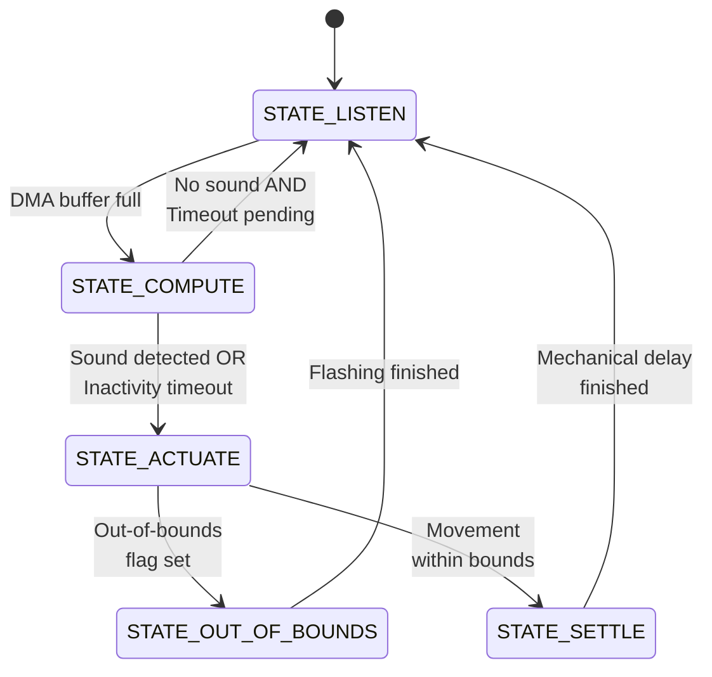
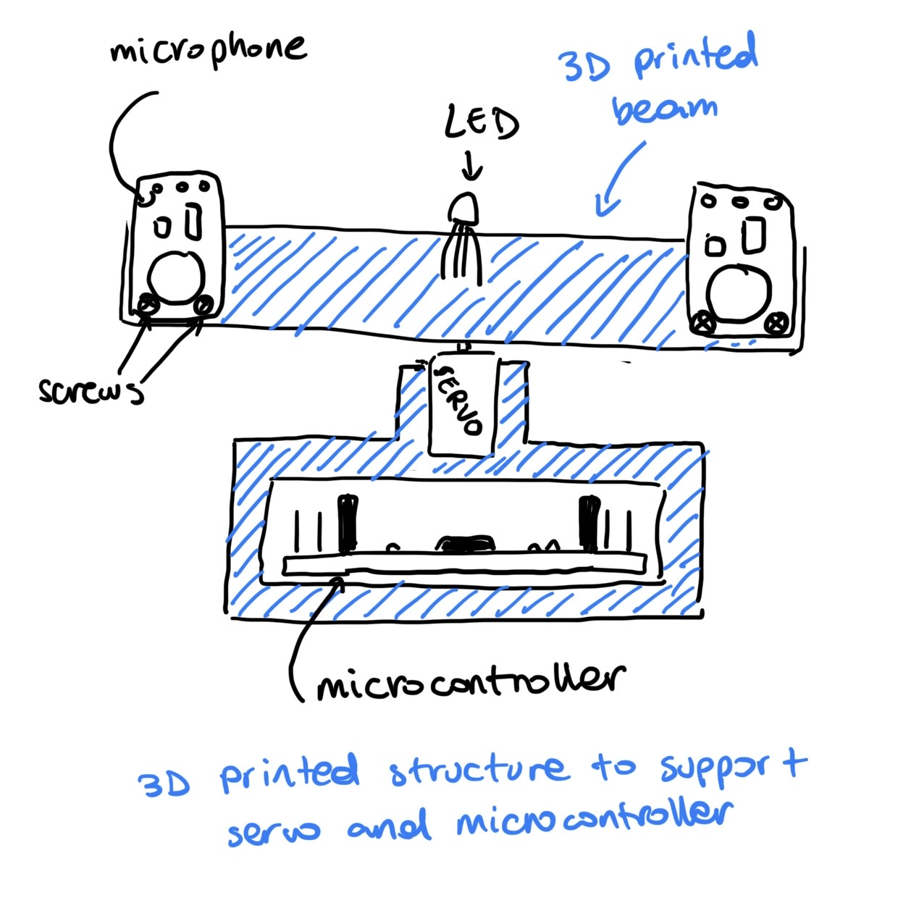
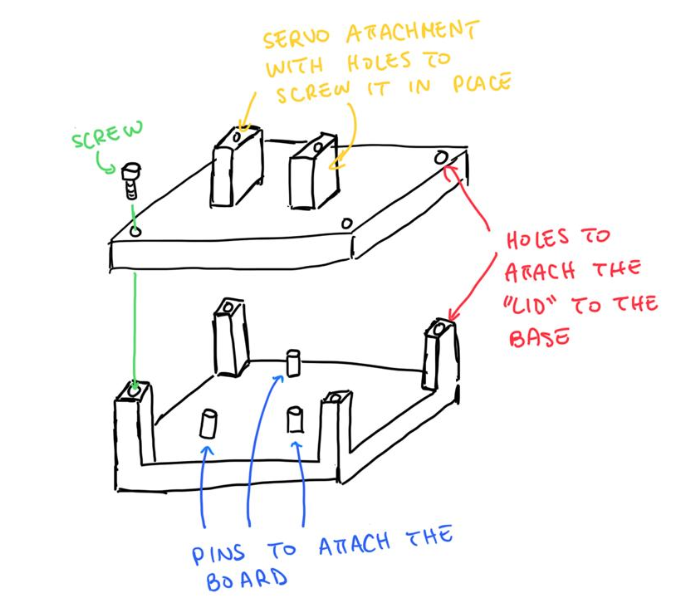
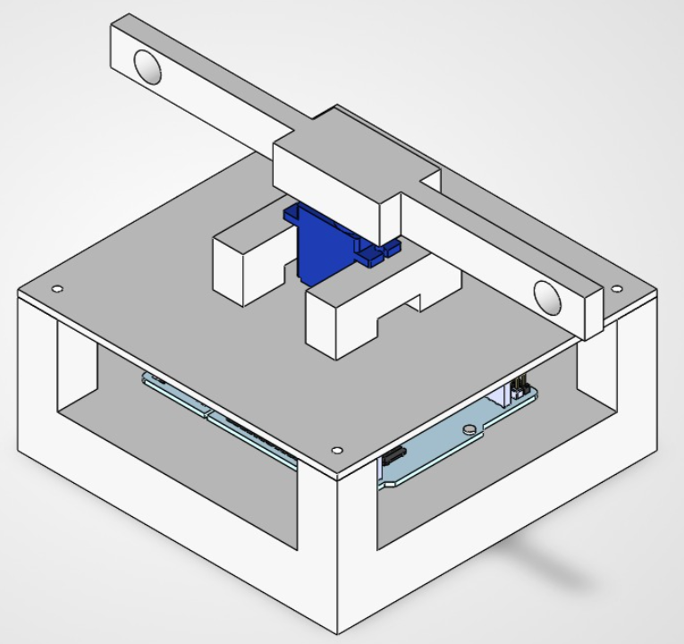
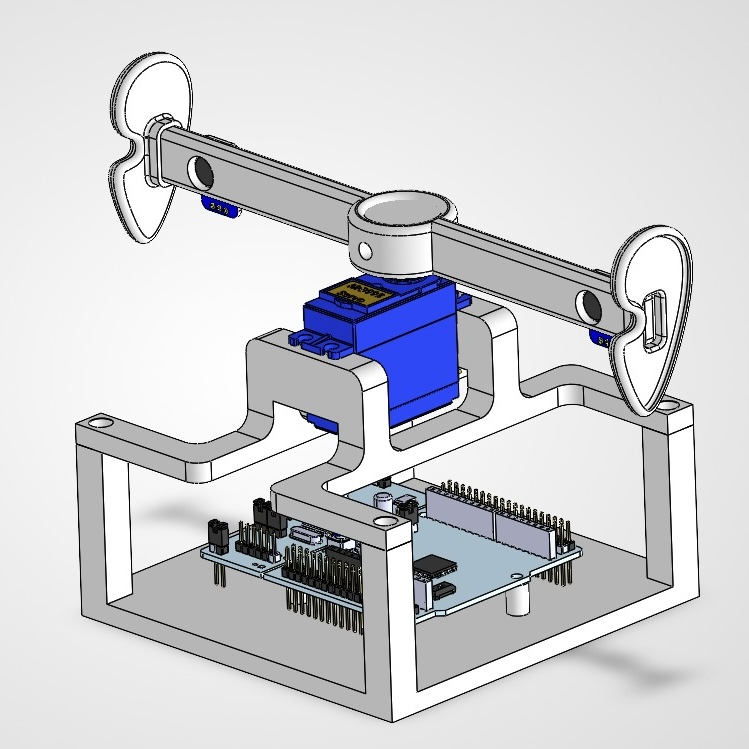
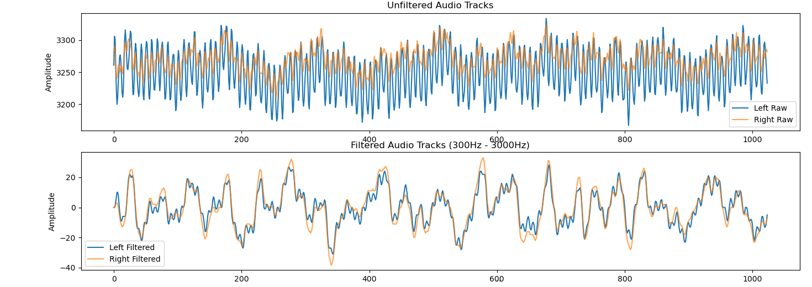
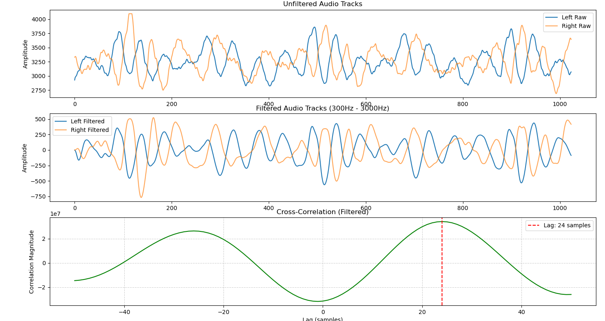

# Technical Report: Real-Time SSL and Tracking System

| Name | Matr. | Email |
|------|---------|-------|
| Samuele Ribaudo | 03821248 | samuele.ribaudo@tum.de |
| Hong Yan Jun  | 03813507 | go75kes@mytum.de |

## 1. Introduction
This project is a robotic "hearing" system that can detect where a sound is coming from and automatically turn to face it.

Using an STM32 microcontroller and two standard microphones, the system acts like a pair of human ears. When a person speaks, the system calculates the sound's origin and uses a servo motor to physically rotate the sensor array toward the speaker. It is designed to mimic a human neck's 180° range of motion. If a sound moves beyond what the system can physically reach, an onboard RGB LED signals a visual warning, acting as a modular trigger that would theoretically tell a larger humanoid robot to rotate its entire body.

---

## 2. MCU Configuration (Samuele)

> The Nucleo board was configured via the STM32CubeMX visual configurator to generate the base C project. Complete peripheral settings are detailed in [section 6 of the repository's README](https://github.com/samuele-ribaudo/real-time-SSL-and-tracking/blob/main/README.md)

### 2.1 Sampling frequency and ADC triggering (Timer 3)

One of the first challenges was determining the optimal microphone sampling frequency, balancing spatial resolution with physical memory constraints.

Given a microphones distance of `d = 0.15 m`, and a speed of sound `v = 343 m/s`, the maximum time delay between channes is `Δt_max = d / v ≈ 437 us`. A standard 16 kHz audio sampling rate (`t_s = 62.5 us`) yelsd a maximum offset of `437 / 62.5 ≈ 7` samples on each side, for a total range of 14 samples, limiting  our servo angular resolution to a coarse 13° (180° / 14). To achieve finer angular control, a higher sampling frequency was required.

However, our memory limits us to 1024-sample buffers. Extremely high sampling rates (e.g., 1 MHz) would fill the buffer in approximately 1 ms. This short recording window causes two major issues: the lower frequencies of human speech cannot be properly captured for the DSP pipeline (e.g., a 300 Hz wave requires ≈ 3.3 ms for a full period), and there is a high risk of only capturing the silences between spoken letters.

To find the sweet spot between accurate fine-grained servo positioning and sufficient audio recording length, we settled on a sampling frequency of 50 kHz. This yields an audio track of approximately 20 ms, which is long enough to capture about six full wave periods of human voice at 300 Hz, while drastically improving the angular resolution to approximately 4°.
Based on these considerations, Timer 3 was configured to trigger the ADC conversions at a 50 kHz frequency.

### 2.2 Analog-to-Digital Converter (ADC) & DMA

To guarantee high-speed, non-blocking data acquisition, the 12-bit ADC operates in scan mode, capturing both microphone channels simultaneously on the Timer 3 trigger. Crucially, data is routed directly to memory via Direct Memory Access (DMA). This completely offloads the CPU during the listening phase, ensuring microsecond-level synchronization without computational bottlenecks.

### 2.3 Servo motor actuation (Timer 2)

Timer 2 is configured to generate the 50 Hz PWM signal required for the 180° servo motor. By prescaling the internal 16 MHz clock, we achieve a 1 µs timer resolution. We configured an initial 1.5 ms PWM pulse to guarantee that the servo safely snaps to the exact 90° center position immediately upon power-up, preventing erratic startup movements.

### 2.4 Status indication (GPIO)

Three standard GPIO output pins are mapped to the onboard RGB LED. This provides a simple, interrupt-free method for real-time visual feedback of the system's finite state machine transitions.

---

## 3. Application logic (Samuele)

### 3.1 Codebase organization

To organize the auto-generated STM32CubeMX code, we moved all hardware initialization into a single `stm32cubeMX_setup(void)` wrapper function and we removed all the unnecessary comments, keeping `main.c` clean. Additionally, we created a `config.h` file to store all tunable parameters and physical constants in one place, making it easy to adjust system settings at compile time.

To maintain a clean and readable main loop, we abstracted key operations into dedicated helper functions for LED control, audio data splitting, angle computation, and servo actuation.

### 3.2 Finite State Machine (FSM)

Because servo gears create acoustic noise, the system cannot listen and move at the same time. To address this limitation, the system relies on a strict, sequential FSM:

> Figure: State transition diagram for the acoustic localization and tracking pipeline.

* `STATE_LISTEN` (Blue): The servo is locked while the ADC+DMA pipeline records 1024 audio samples. Once the buffer is full, the DMA interrupt wakes the CPU and transitions the system to the compute phase.

* `STATE_COMPUTE` (Blue): Recording halts and the raw data is split and passed through the DSP pipeline.
    * If a sound is detected, the system calculates the angle offset, applies it to the current angle (flagging if it exceeds physical limits), and moves to `STATE_ACTUATE`.
    * If no sound is detected, the system checks an inactivity timeout. If the silence exceeds the maximum allowed time and the servo is not already centered, it targets the center position and moves to `STATE_ACTUATE`. Otherwise, it simply rolls back to `STATE_LISTEN`.

* `STATE_ACTUATE` (Green): The MCU updates the servo's position. If an out-of-bounds value was flagged during computation, the FSM transitions directly to `STATE_OUT_OF_BOUNDS`. If the movement is within normal limits, it proceeds to `STATE_SETTLE`.

* `STATE_SETTLE` (Green): A brief, blocking delay allows all mechanical servo vibrations to dissipate before the system safely loops back to `STATE_LISTEN`.

* `STATE_OUT_OF_BOUNDS` (Red Flash): The out-of-bounds flag is cleared, and the system flashes the red LED to provide a visual warning that the target exceeded the 180° physical limit. Once the flashing sequence finishes, it returns to `STATE_LISTEN`.

---

## 4. CAD design
For the CAD design, we started with a first sketch and then bring it into 3-dimensional space with Solidworks. The first design was a proof of concept so that we could be sure that the system could actually be implemented physically and all the components could be connected functionally with each other. We started designing the system with a rough estimate of the measurements because we did not have the components yet. After receiving the components, we had to implement the correct measurements in our design. so that Once the first design has been materialized and our first prototype was fully functional, we switch our focus on the aesthetic aspect of the design to make look cooler instead of just square edges everywhere. In the first design, the cables connection were quite messy, so we decided to hide them away in the bar as this will give the system a much cleaner look.

  
  

> Figure: Initial sketches and brainstorming

  
  

> Figure: Left: Initial design without correct measurements. Right: Final design.
---

## 5. Hardware fabrication (Ryan)
In the initial prototyping phase, the components were connected using traditional jumper cables and a breadboard. To reduce the system's footprint and eliminate the need for a bulky external breadboard, we soldered the common grounds and VCC connections directly into unified lines. Additionally, 330 Ohm current-limiting resistors were embedded directly inside the wires leading to the RGB LED channels to protect the hardware from overcurrent damage. 

To improve system readability and simplify debugging, we adopted a standardized, purpose-driven wire coloring scheme:

| Wire color | Purpose / Connection |
| :--- | :--- |
| White | Main 5V power supply line routed to the components. |
| Black | Common Ground (GND) connection to establish a shared reference plane. |
| Red | Digital control for the RGB LED Red channel. |
| Green | Digital control for the RGB LED Green channel. |
| Blue | Digital control for the RGB LED Blue channel. |
| Orange | Dedicated PWM signal line to control the 180° servo motor actuation. |
| Purple | Analog output signal transmission from the left microphone. |
| Yellow | Analog output signal transmission from the right microphone. |

Another hardware challenge involved the servo motor, which exhibited aggressive perturbations whenever the bar reached the 90° center point facing forward. After consulting with our supervisor, we decided to use a brand new servo motor. While replacing the unit with a brand new servo motor initially resolved the issue, the perturbations returned after extensive testing. We suspect this instability stems from voltage fluctuations in the servo motor's power source rather than a mechanical failure.

---

## 6. Signal filtering & testing framework (Samuele)

### 6.1 Microphone validation & data collection

To validate our Sound Source Localization (SSL) algorithms, we developed a data collection framework (`testing/microphone_data_collector`). We recorded baseline audio tracks from the analog microphones in a quiet room, and with a human voice originating from the left, center, and right. These recordings allowed us to verify synchronous audio capture, physically adjust the MAX4466 hardware gain, and establish a reliable "quiet room" amplitude threshold to keep the finite state machine idle during silence.

### 6.2 Python ground truth & C/C++ DSP verification

Once the baseline was established, we introduced complex environmental disturbances into our recordings. We captured new voice samples from various angles while simultaneously playing a 100 Hz low-frequency hum and a 6 kHz high-frequency noise. These noisy samples were first processed using Python DSP libraries to establish a mathematical ground truth.

Then we built a standalone C-based DSP testing framework (`testing/dsp_pipeline_test`). It ingests the raw CSV data, processes it through our custom C/C++ pipeline, and exports the results. A Python script (`plot_audio.py`) visualized these outputs, allowing us to benchmark our embedded C algorithms against the Python ground truth before flashing the code to the STM32.

### 6.3 Filter design and iterations
The pipeline relies on a bandpass filter to isolate human speech (approximately 300 Hz to 3000 Hz). We initially implemented a 2nd-order biquad filter, using MATLAB's `butter` function to generate the coefficients. However, testing revealed this lacked the steep roll-off required. The 6 kHz high-frequency disturbance was not attenuated enough, passing through the filter and severely corrupting the cross-correlation stage. This produced a sparse, noisy array with ambiguous peaks, causing the system to calculate incorrect time delays. 

To resolve this, we upgraded the architecture to a 6th-order Butterworth filter, again utilizing MATLAB to compute the cascaded coefficients. This filter yielded highly satisfactory results, successfully suppressing both the 100 Hz and 6 kHz disturbances. As shown below, the filter effectively flattens the noise floor in a quiet room:

> Figure: unfiltered quiet room recording with 100 Hz and 6 kHz disturbances (top) and the resulting flattened noise floor after 6th-order bandpass filtering (bottom).

---

## 7. DSP pipeline (Ryan)

The DSP architecture executes entirely on the STM32 during the `STATE_COMPUTE` window, processing two 1024-sample raw ADC buffers to calculate the Time Delay of Arrival (TDOA) without relying on external libraries. To meet strict real-time MCU constraints, the pipeline is divided into three optimized stages:

### 7.1 Event Detection (Amplitude Thresholding)
To prevent the MCU from continuously running heavy arithmetic on background noise, the pipeline acts as a gatekeeper. It calculates the peak-to-peak amplitude ($max - min$) of the incoming buffers. If the spread falls below the established ambient noise floor, the pipeline aborts to save power and processing time.

### 7.2 Zero-Phase Signal Conditioning
Because raw microphone data contains a positive DC voltage offset, the signal must be conditioned. Initial implementations using an IIR Biquad Band-Pass filter (300 Hz - 3000 Hz) caused frequency-dependent phase distortion ("ringing"), which temporally misaligned the acoustic waves and corrupted the cross-correlation output. To solve this, we implemented a zero-phase Mean-Centering approach: the MCU calculates the discrete baseline average of the 1024 samples and subtracts it, perfectly centering the wave at zero using safe integer arithmetic.

### 7.3 Boundary-Optimized Cross-Correlation
Standard cross-correlation of two 1024-sample arrays requires over 1,000,000 operations, exceeding real-time limits. However, given the physical microphone spacing ($d = 0.15$ m) and the speed of sound, the absolute maximum theoretical time delay between the two ears is just $\pm 22$ samples. By strictly bounding the search loop to this physical constraint, the algorithm's workload is reduced to just ~45 iterations. The discrete lag index that produces the highest correlation score is then returned to the geometric control logic.

### 7.4 Pipeline validation

The DSP pipeline is fully functional. With the environmental noise successfully attenuated, the cross-correlation of the filtered signals produces a singular, well-defined peak, allowing the system to accurately actuate the servo motor.

> Figure: Validation of the working pipeline during a right-side sound test. It displays the unfiltered raw audio tracks with disturbances (top), the cleanly filtered signals between 300 Hz and 3000 Hz (middle), and the resulting cross-correlation (bottom) demonstrating a well-defined peak at a 24-sample lag for precise TDOA calculation.

### 7.5 TDOA and angle calculation

The calculation of the sound source's angle is handled by the `compute_angle_offset()` function defined insize `code/Core/Src/main.c`. Once the time delay `Δt` is derived from the sample offset, calculating the relative azimuth angle `θ` is a straightforward application of the following geometric formula:

$$\theta = \arcsin\left(\frac{\Delta t \cdot v}{d}\right)$$

Even though harder to read, we deliberately chose to perform and maintain all angular calculations in radians. Because the standard C math library's `asinf()` function inherently returns a value in radians, using radians as our system's base unit of measure (e.g., defining the `SERVO_MAX_ANGLE` directly as π) allows us to avoid the unnecessary computational overhead that would be required to convert the values into degrees.

---

## 8. Conclusions

The development of the Real-Time Sound Source Localization and Tracking System yielded highly satisfactory results. The custom DSP pipeline executes entirely on the MCU and works exceptionally well to accurately calculate the Time Delay of Arrival (TDOA).

While the core acoustic and computational goals were achieved, we identified the following areas for future improvement:

* **Robust actuation:** Switching to a more powerful, metal-geared servo motor to prevent the continuous mechanical breakdowns experienced during testing.

* **Dedicated power supply:** Adding an external 5V power source for the servo motor to prevent it from drawing excessive current from the board, directly addressing the voltage fluctuations and instability observed during actuation.
